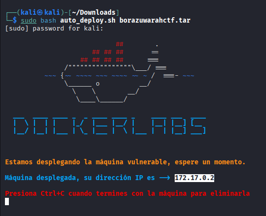
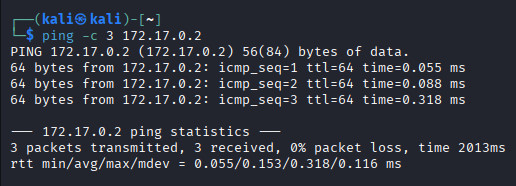
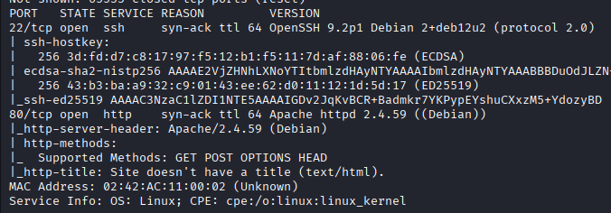
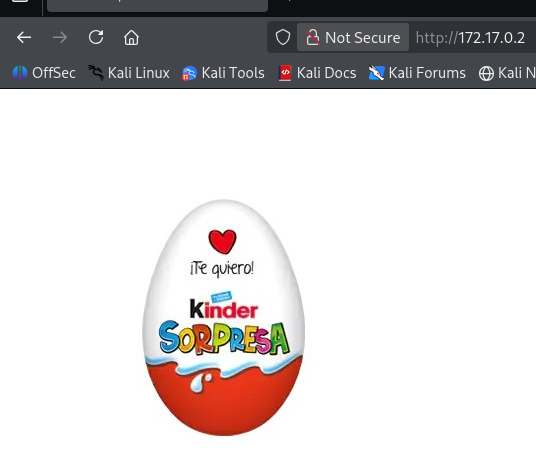
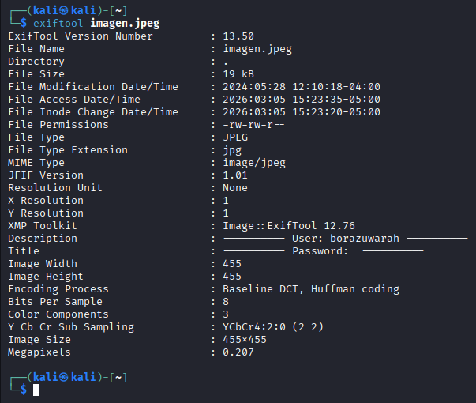
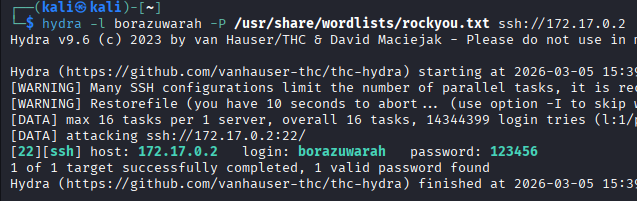
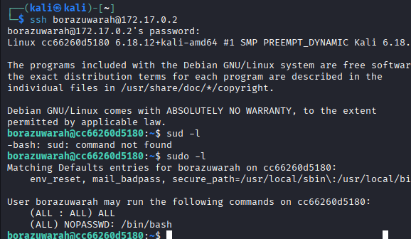
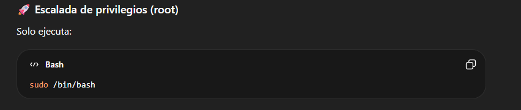
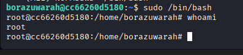

# BorazuwarahCTF

## Información General

| Campo | Detalle |
|------|------|
| Máquina | BorazuwarahCTF |
| Plataforma | DockerLabs |
| Dificultad | Muy Fácil |
| Tipo | Capture The Flag (CTF) |
| Objetivo | Obtener acceso root mediante técnicas de enumeración y escalada de privilegios |

---

## Descripción

En este laboratorio se analiza la máquina **BorazuwarahCTF**, clasificada con un nivel de dificultad **muy fácil** y disponible en la plataforma **DockerLabs**.

---

## Reconocimiento

Se realiza una prueba de conectividad mediante **ping** hacia la máquina objetivo. La respuesta confirma que el host se encuentra activo y devuelve un valor **TTL=64**, el cual es comúnmente asociado a sistemas basados en **Linux/Unix**. Este indicador permite inferir que el sistema operativo del objetivo probablemente pertenece a esta familia.

---

## Escaneo de Puertos

Se lleva a cabo un escaneo de puertos mediante **Nmap** para identificar los servicios disponibles en el sistema objetivo.

El análisis revela que los puertos **22 (SSH)** y **80 (HTTP)** se encuentran abiertos, lo que sugiere la presencia de un servicio de administración remota y un servidor web activo.

---

## Enumeración Web

Se accede al servicio web mediante un navegador introduciendo la **dirección IP del objetivo**. Al analizar el contenido de la página, se identifica una imagen como único recurso visible.

Dicha imagen es descargada al sistema local con el fin de realizar un **análisis de metadatos**, ya que estos pueden contener información oculta o pistas relevantes para avanzar en el proceso de enumeración.

---

## Análisis de Metadatos

Se procede a analizar los metadatos de la imagen utilizando la herramienta **ExifTool**.

El análisis revela la presencia del usuario **borazuwarah** dentro de la información EXIF del archivo, lo que podría indicar un posible **nombre de usuario válido en el sistema**, útil para futuras pruebas de autenticación o enumeración de servicios.

---

## Ataque de Fuerza Bruta

Una vez identificado el posible nombre de usuario **borazuwarah**, se procede a realizar un ataque de **fuerza bruta** contra el servicio **SSH** utilizando la herramienta **Hydra**, con el objetivo de descubrir credenciales válidas.

Tras ejecutar el ataque, se logra identificar la contraseña **123456**, permitiendo así obtener acceso al sistema mediante el usuario previamente descubierto.

---

## Acceso al Sistema

Se establece acceso al sistema mediante SSH. Posteriormente, se ejecuta el comando `sudo -l` con el objetivo de enumerar los privilegios sudo del usuario actual.

La salida indica la regla `NOPASSWD: /bin/bash`, lo que permite ejecutar `/bin/bash` como superusuario sin requerir contraseña. Aprovechando esta configuración.

---

## Escalada de Privilegios

Investigamos posibles vectores de escalada de privilegios relacionados con `/bin/bash`, identificando que puede ejecutarse con privilegios elevados mediante `sudo`, lo que permite obtener una shell con privilegios de superusuario.

---

## Obtención de Root

Finalmente, ejecutamos `sudo /bin/bash` para aprovechar el permiso `NOPASSWD`. Una vez obtenida la shell con privilegios elevados, verificamos el contexto de usuario mediante el comando `whoami`, confirmando acceso como `root`.

---

## Resultado

Escalada de privilegios exitosa obteniendo acceso completo como **root** en el sistema.

## Conclusión

Durante el desarrollo de este laboratorio se llevó a cabo un proceso completo de **reconocimiento, enumeración, explotación y escalada de privilegios** sobre la máquina objetivo.

A través del análisis inicial se identificaron servicios expuestos, específicamente **SSH** y **HTTP**. Posteriormente, mediante el análisis de **metadatos** en un recurso disponible en el servidor web, fue posible obtener un **nombre de usuario válido**, lo que permitió realizar un ataque de **fuerza bruta** contra el servicio SSH hasta descubrir credenciales válidas.

Una vez obtenido acceso al sistema, la enumeración de privilegios mediante `sudo -l` reveló una configuración insegura que permitía ejecutar **/bin/bash** como superusuario sin requerir contraseña (`NOPASSWD`). Esta mala configuración facilitó la **escalada de privilegios**, permitiendo obtener una shell con privilegios de **root**.

Este laboratorio demuestra la importancia de realizar una correcta **gestión de credenciales, control de accesos y configuración segura de privilegios sudo**, ya que configuraciones inadecuadas pueden comprometer completamente la seguridad del sistema.

## Recomendaciones de Seguridad

A partir de las vulnerabilidades identificadas durante el análisis de la máquina, se proponen las siguientes medidas de mitigación:

- **Fortalecer las credenciales de acceso**: Evitar el uso de contraseñas débiles o comunes como `123456`. Se recomienda implementar políticas de contraseñas robustas que incluyan longitud mínima, caracteres especiales y renovación periódica.

- **Implementar mecanismos de protección contra fuerza bruta**: Utilizar herramientas como **Fail2Ban** o limitar los intentos de autenticación en **SSH** para prevenir ataques automatizados.

- **Restringir el acceso al servicio SSH**: Configurar autenticación mediante **claves públicas/privadas** en lugar de contraseñas y deshabilitar el acceso para usuarios no autorizados.

- **Eliminar información sensible en archivos públicos**: Evitar exponer información potencialmente sensible en **metadatos de archivos**, ya que pueden revelar nombres de usuario u otra información útil para un atacante.

- **Configurar correctamente los privilegios de sudo**: Evitar reglas como `NOPASSWD` para binarios críticos como `/bin/bash`, ya que esto puede permitir una escalada de privilegios inmediata.

- **Aplicar el principio de mínimo privilegio**: Los usuarios solo deben tener los permisos estrictamente necesarios para realizar sus funciones.

- **Realizar auditorías de seguridad periódicas**: Revisar configuraciones del sistema, servicios expuestos y permisos de usuarios para detectar configuraciones inseguras antes de que puedan ser explotadas.
